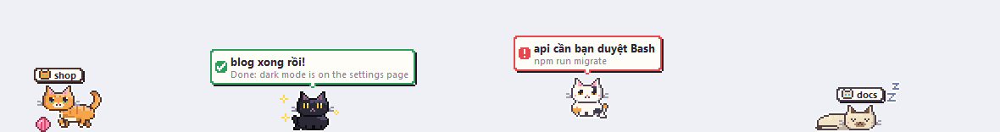

# Claude Pet

Pixel pets that live above your Windows taskbar and tell you when **Claude Code** is done or needs you, so you can watch YouTube while it works.



- **One pet per Claude Code session**, from the VS Code extension or the CLI.
- **While Claude works**, cats chase a ball of yarn. Pets from a pack can use a move instead (water, fire, leaves).
- **When Claude finishes or needs a decision**, the pet hops with a bubble and a chime. The bubble shows the question, the command waiting for approval, or the first line of Claude's answer.
- **It stays out of the way.** Pets hide while VS Code is in front. Over a fullscreen video only pets with news show up. It never takes keyboard focus, and clicks pass through the empty parts.
- **Click** a pet to bring its VS Code window to the front. **Drag** it to move it. **Right-click** it for settings: pet pack, swap this pet, bigger pets, quit.
- **Each project keeps its pet**, so you can tell sessions apart at a glance.

The bubbles and menus are in Vietnamese for now.

## Install

You need Windows 10 or 11, [Claude Code](https://claude.com/claude-code), and Python 3.10+ with tkinter. Both the python.org installer and Anaconda include tkinter.

```bash
git clone https://github.com/Nhwng/claude-pet
cd claude-pet
python pet.py install    # hooks + a "Claude Pet" Start Menu shortcut
pythonw pet.py           # start it (or: Start Menu → Claude Pet)
```

`install` adds hook entries to your **global** `~/.claude/settings.json`. It writes a timestamped backup next to that file first and leaves your other hooks alone. The hooks store the absolute paths of this folder and of your Python, so run `install` again if either one moves.

Sessions that were already open keep the hooks they loaded at startup, so open a new Claude Code session. To remove everything, run `python pet.py uninstall`.

## Use

| You want to | Do this |
|---|---|
| Open the session's VS Code window | Click its pet |
| Move a pet | Drag it, then let go |
| Switch pet pack, swap a pet, bigger pets, quit | Right-click a pet |
| Switch packs while no pet is visible | `python pet.py pack <name>` (no name lists them) |
| Start it again after quitting | Start Menu → **Claude Pet** |

## Pet packs

Eight cat breeds are built in. To add a pack, put `packs/<name>.json` in this folder, restart the pet, and pick it from the right-click menu.

```json
{
  "name": "My pack",
  "scale": 1,
  "pets": [{
    "name": "Blob",
    "about": "One line about it",
    "colors": {"A": "#1b1b22", "B": "#3ab0ff", "W": "#ffffff"},
    "rows": ["..AAAA..", ".ABBBBA.", "ABWBBWBA", "ABBBBBBA", ".AAAAAA."],
    "shut": ["..AAAA..", ".ABBBBA.", "ABABBABA", "ABBBBBBA", ".AAAAAA."],
    "move": {"name": "Water Gun", "kind": "water", "mouth": [7, 2]}
  }]
}
```

- **`rows`** is the pixel art, facing right. Each letter is a colour from `colors`, and `.` is transparent. Don't use the letters `g` or `v`.
- **`shut`** is the same sprite with its eyes closed, used for sleeping.
- **`move`** is optional. `kind` is `water`, `fire` or `leaf`, and `mouth` is the `[x, y]` pixel the shots come out of. If every pet in a pack has a move, the pets stand and use it while Claude works. Otherwise they walk.
- **`tools/grid_to_pack.py`** turns pixel-grid images, like cross-stitch charts, into a pack. It needs Pillow. Only make and share packs from art you have the rights to.

## How it works

Claude Code [hooks](https://docs.claude.com/en/docs/claude-code/hooks) run `pet.py hook` on these events: prompt submitted, tool used, permission asked, `AskUserQuestion` or `ExitPlanMode` about to run, turn stopped, and session ended. The hook writes one small JSON file per session in `~/.claude-pet/`. It never prints anything and always exits 0, so it can't block or steer Claude. Headless runs (`claude -p`, the Agent SDK) are ignored.

`app.py` is the window. It is a transparent, click-through, always-on-top tkinter strip that reads those files about twice a second. It animates at 30 fps while something moves and slows down when nothing does. Run `python pet.py test` for the self-check.

**Privacy:** nothing leaves your machine. `~/.claude-pet/events.log` keeps short local excerpts (commands, questions, the start of answers) for debugging. Delete the folder to clear it.

## Tiếng Việt

Thú cưng pixel sống trên thanh taskbar. Mỗi phiên Claude Code là một con. Khi Claude đang làm, mèo vờn cuộn len. Khi Claude xong việc hoặc cần bạn quyết định, pet nhảy lên kèm bong bóng ghi rõ chuyện gì. Bấm vào pet để mở đúng cửa sổ VS Code, kéo để di chuyển, chuột phải để cài đặt.

Cài đặt: `python pet.py install` rồi `pythonw pet.py`, hoặc mở **Claude Pet** trong Start Menu.

## License

[MIT](LICENSE)
