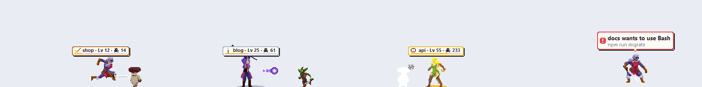

# Claude Pet

[](https://github.com/Nhwng/claude-pet/actions/workflows/test.yml)

Pixel pets that live above your Windows taskbar and tell you when **Claude Code** is done or needs you, so you can watch YouTube while it works.




- **One pet per Claude Code session**, from the VS Code extension or the CLI.
- **While Claude works**, cats chase a ball of yarn, and the Critters, a family of slimes, hop around and use their moves: Water Gun, Ember, Razor Leaf.
- **When Claude finishes or needs a decision**, the pet hops with a bubble and a little chiptune chime. The bubble shows the question, the command waiting for approval, or the first line of Claude's answer.
- **It stays out of the way.** Pets hide while VS Code is in front. With two monitors you pick which one they live on, or let them follow the window you're in. Over a fullscreen video only pets with news show up. It never takes keyboard focus, and clicks pass through the empty parts.
- **Click** a pet to bring its VS Code window to the front. **Drag** it to move it. **Right-click** it to swap it for another pet, or open **⚙ Settings**: pet pack, screen, bigger pets, sound, start with Windows, language, quit.
- **Each project keeps its pet**, so you can tell sessions apart at a glance.
- **Rest the pointer on a pet** to see how many tokens Claude has written for its project, all time.
- **Game mode** (optional): every session is a hero that fights a monster for each tool Claude calls, beats a boss when Claude finishes, and levels up on the tokens Claude writes. See [Game mode](#game-mode).

It speaks English or Vietnamese. You can switch in ⚙ Settings.

## Install

You need Windows 10 or 11, [Claude Code](https://claude.com/claude-code), and Python 3.10+ with tkinter. Both the python.org installer and Anaconda include tkinter.

```bash
git clone https://github.com/Nhwng/claude-pet
cd claude-pet
python pet.py install    # hooks + a "Claude Pet" Start Menu shortcut
pythonw pet.py           # start it (or: Start Menu → Claude Pet)
```

`install` adds hook entries to your **global** `~/.claude/settings.json`. It writes a timestamped backup next to that file first and leaves your other hooks alone. The hooks store the absolute paths of this folder and of your Python, so run `install` again if either one moves.

Sessions that were already open keep the hooks they loaded at startup, so open a new Claude Code session. To start the pet whenever you sign in to Windows, tick **Start with Windows** in ⚙ Settings. To remove everything, run `python pet.py uninstall`.

## Use

| You want to | Do this |
|---|---|
| Open the session's VS Code window | Click its pet |
| Move a pet | Drag it, then let go |
| Swap a pet for another one | Right-click it, then **Swap to …** |
| Switch pack, bigger pets, sound, language, quit | Right-click a pet, then **⚙ Settings** |
| Put the pets on your other monitor | **⚙ Settings → Screen**: main, second, or follow my window |
| Start the pet with Windows | **⚙ Settings → Start with Windows** (click again to turn it off) |
| Play Game mode, or go back to Chill | **⚙ Settings → Mode** (shows once you have a cast, see below) |
| Switch packs while no pet is visible | `python pet.py pack <name>` (no name lists them) |
| Start it again after quitting | Start Menu → **Claude Pet** |

## Pet packs

Two packs come with it: eight cat breeds, and the three Critter slimes in [`packs/critters.json`](packs/critters.json), which also serve as an example of the format. To add a pack, put `packs/<name>.json` in this folder, restart the pet, and pick it in ⚙ Settings.

```json
{
  "name": "My pack",
  "scale": 1,
  "hop": true,
  "pets": [{
    "name": "Blob",
    "about": "One line about it",
    "colors": {"A": "#1b1b22", "B": "#3ab0ff", "W": "#ffffff"},
    "rows": ["..AAAA..", ".ABBBBA.", "ABWBBWBA", "ABBBBBBA", ".AAAAAA."],
    "shut": ["..AAAA..", ".ABBBBA.", "ABABBABA", "ABBBBBBA", ".AAAAAA."],
    "move": {"name": "Water Gun", "kind": "water", "mouth": [7, 2]}
  }]
}
```

- **`rows`** is the pixel art, facing right. Each letter is a colour from `colors`, and `.` is transparent. Don't use the letters `g` or `v`.
- **`shut`** is the same sprite with its eyes closed, used for sleeping.
- **`move`** is optional. `kind` is `water`, `fire` or `leaf`, and `mouth` is the `[x, y]` pixel the shots come out of. If every pet in a pack has a move, the pets stand and use it while Claude works. Otherwise they walk.
- **`hop`** is optional. Set it to `true` and pets with moves hop around like slimes between moves: squash, spring, land.
- **`tools/grid_to_pack.py`** turns pixel-grid images, like cross-stitch charts, into a pack. It needs Pillow. Only make and share packs from art you have the rights to.

## Game mode

Turn the pets into heroes. Each Claude Code session gets a knight, a fighter or a mage (each project keeps its own):

- **Every tool Claude calls** sends a monster at the hero (up to three on screen, the rest wait in line), and the hero cuts it down: a slash, a punch, a spell.
- **When Claude finishes**, a boss walks up and takes a few blows, with the usual bubble and chime. Higher-ranked heroes meet bigger bosses that take more blows to bring down. **When Claude needs you**, everything holds still under a red bubble. **Asleep**, the hero dozes by a campfire.
- **Rest the pointer on a hero** for its card: tokens written, how far to the next level, bosses and bugs beaten. The bosses also show on its name plate.
- **Heroes level up on the output tokens Claude writes** for their project, slowly: about a week of work for Lv 10, a month for Lv 20. Levels start at 1 when you first turn Game mode on. Bronze, silver and gold plates at Lv 10, 25 and 50, with an aura and glitter on top.

Game mode draws artists' sprite sheets, which you download yourself (their licences don't allow re-sharing them here):

1. Download, all free, and unzip each into this folder: [Hero Knight 2](https://luizmelo.itch.io/hero-knight-2), [Elf Fighter Female](https://pixel-magic.itch.io/elf-fighter-female-2d-sprite), [Wizard Pack](https://luizmelo.itch.io/wizard-pack) and [Monsters Creatures Fantasy](https://luizmelo.itch.io/monsters-creatures-fantasy). You should end up with, for example, `Hero Knight 2/Hero Knight 2/Sprites/Idle.png`.
2. Copy [`tools/cast-recipe.example.json`](tools/cast-recipe.example.json) to `packs/cast-recipe.json`, and fix any folder name that differs on your machine.
3. Make the cast file (this one step needs Pillow): `pip install pillow`, then `python tools/make_cast.py packs/cast-recipe.json packs/cast.json`.
4. Restart the pet, then **⚙ Settings → Mode → Game**.

The recipe can use any packs with sprite strips (one row of frames per animation): give each character `idle`, `run`, `attack` (and `attack2`, `attack3`… to vary its blows), `hurt` and `death`, a `height` in screen pixels (packs drawn at different sizes come out alike: small art is enlarged with Scale2x, big art scaled down smoothly) and, for heroes, an `attack` of `slash`, `punch`, `spell` or `arrow`. `tone` livens up a dull palette. A boss's `tier` (1 bronze, 2 silver, 3 gold) keeps it away until a hero reaches that rank. `make_cast.py` works out frame counts, where the body stands, which way it faces and when a blow lands.

Art in the cast above: Hero Knight 2, Wizard Pack and Monsters Creatures Fantasy by [LuizMelo](https://luizmelo.itch.io/); Elf Fighter Female by Chet ([Pixel Magic](https://pixel-magic.itch.io/)). Thank you!

## How it works

Claude Code [hooks](https://docs.claude.com/en/docs/claude-code/hooks) run `pet.py hook` on these events: prompt submitted, tool used, permission asked, `AskUserQuestion` or `ExitPlanMode` about to run, turn stopped, and session ended. The hook writes one small JSON file per session in `~/.claude-pet/`. It never prints anything and always exits 0, so it can't block or steer Claude. Headless runs (`claude -p`, the Agent SDK) are ignored.

`app.py` is the window. It is a transparent, click-through, always-on-top tkinter strip that reads those files about twice a second. It animates at 30 fps while something moves and slows down when nothing does. Run `python pet.py test` for the self-check.

**Privacy:** nothing leaves your machine. `~/.claude-pet/events.log` keeps short local excerpts (commands, questions, the start of answers) for debugging. For the hover cards and Game mode levels, the pet reads the token counts in Claude Code's transcripts (`~/.claude/projects`): all of them once at first start (this can take a minute if you have years of them), then only new lines. It keeps only totals per project, plus Game mode's bosses and bugs beaten, in `~/.claude-pet/game.json`. Delete the folder to clear it.

## Tiếng Việt

Thú cưng pixel sống trên thanh taskbar. Mỗi phiên Claude Code là một con. Khi Claude đang làm, mèo vờn cuộn len còn ba bé slime (bộ Thú nhỏ) nhảy tưng tưng và ra chiêu. Khi Claude xong việc hoặc cần bạn quyết định, pet nhảy lên kèm bong bóng ghi rõ chuyện gì và một tiếng chiptune. Bấm vào pet để mở đúng cửa sổ VS Code, kéo để di chuyển, chuột phải để đổi con hoặc mở ⚙ Cài đặt. Để chuột yên trên pet để xem Claude đã viết bao nhiêu token cho dự án đó từ trước tới giờ (lần chạy đầu pet đọc số token trong toàn bộ transcript ở `~/.claude/projects` một lần, chỉ giữ tổng mỗi dự án, không gửi đi đâu).

Cài đặt: `python pet.py install` rồi `pythonw pet.py`, hoặc mở **Claude Pet** trong Start Menu. Muốn dùng tiếng Việt thì chuột phải vào pet, chọn **⚙ Settings**, rồi bấm **Tiếng Việt**. Cũng trong ⚙: chọn **Màn hình** cho pet (chính, phụ, hoặc tự động theo cửa sổ) và bật/tắt **Tự chạy khi bật máy**.

**Chế độ Game:** mỗi phiên là một anh hùng (hiệp sĩ, đấu sĩ, pháp sư). Mỗi lần Claude dùng tool là một con quái chạy tới, Claude xong việc thì hạ boss (cấp càng cao boss càng to, càng lì đòn), anh hùng lên cấp theo số token Claude viết (Lv 10 mất khoảng một tuần). Thẻ của anh hùng còn ghi số token còn thiếu để lên cấp và số boss, bug đã hạ; số boss hiện cả trên bảng tên. Cần tải các bộ hình ở mục [Game mode](#game-mode) rồi chạy `tools/make_cast.py`, sau đó vào ⚙ → **Chế độ** → **Game**.

## License

[MIT](LICENSE)
